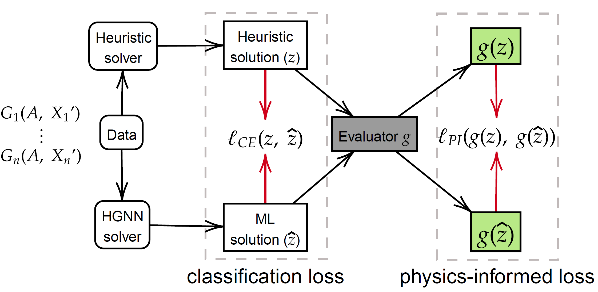

# Physics-Informed Heterogeneous Graph Neural Networks for DC Blocker Placement 

This repository contains the code for the paper __Physics-Informed Heterogeneous Graph Neural Networks for DC Blocker Placement__.
<!-- to be appear in Proceedings of the 23rd Power Systems Computation Conference (PSCC 2024). -->

<p align="center">
  
</p>


* Paper Abstract
  > The threat of geomagnetic disturbances (GMDs) to the reliable operation of the bulk energy system has spurred the development of effective strategies for mitigating their impacts. One such approach involves placing transformer neutral blocking devices, which interrupt the path of geomagnetically induced currents (GICs) to limit their impact. The high cost of these devices and the sparsity of transformers that experience high GICs during GMD events, however, calls for a sparse placement strategy that involves high computational cost. To address this challenge, we developed a physics-informed heterogeneous graph neural network (PIHGNN) for solving the graph-based dc-blocker placement problem. Our approach combines a heterogeneous graph neural network (HGNN) with a physics-informed neural network (PINN) to capture the diverse types of nodes and edges in ac/dc networks and incorporates the physical laws of the power grid. We train the PIHGNN model using a surrogate power flow model and validate it using case studies. Results demonstrate that PIHGNN can effectively and efficiently support the deployment of GIC dc-current blockers, ensuring the continued supply of electricity to meet societal demands. Our approach has the potential to contribute to the development of more reliable and resilient power grids capable of withstanding the growing threat that GMDs pose.

## Installation

Install required packages from `sh setup.sh` if you have GPU available. Otherwise, run `sh setup.sh cpu` to install the required packages for CPU only.

In addition, the package also requires the Julia optimizer [JuMP](https://jump.dev/JuMP.jl/stable/) and [Ipopt](https://coin-or.github.io/Ipopt/) to solve the optimization problem. The installation of the Julia optimizer is not included in the `setup.sh` script. Please install the Julia optimizer manually and follow the steps in the [data/README.md](data/README.md) folder to install the required packages for the heuristic solvers.

## Usage

The package read the customized MATPOWER data file containing both AC and DC networks in `*.m`, and convert the the heterogeneous graph in [PyG](https://pytorch-geometric.readthedocs.io/en/latest/) format. The package also provides the training and testing of the PIHGNN model.

To Run the model with Heterogeneous Graph Neural Network (HGNN) only, run `epri21` as the following command:
```bash
python demo_hgnn.py --names epri21 --verbose
```

To run the model with Physics-Informed Heterogeneous Graph Neural Network (PIHGNN), run the following command:
```bash
python demo_pihgnn.py 
```

The usage of both scripts is as follows:
```bash
python demo_hgnn.py --help 
usage: demo_hgnn.py [-h] [--names NAMES [NAMES ...]] [--force] [--lr LR] [--weight_decay WEIGHT_DECAY] [--hidden_size HIDDEN_SIZE] [--num_heads NUM_HEADS] [--num_conv_layers NUM_CONV_LAYERS] [--num_mlp_layers NUM_MLP_LAYERS]
                    [--act {relu,rrelu,hardtanh,relu6,sigmoid,hardsigmoid,tanh,silu,mish,hardswish,elu,celu,selu,glu,gelu,hardshrink,leakyrelu,logsigmoid,softplus,tanhshrink}] [--conv_type {hgt,han}] [--dropout DROPOUT] [--epochs EPOCHS]
                    [--batch_size BATCH_SIZE] [--seed SEED] [--no_norm] [--test_split TEST_SPLIT] [--gpu GPU] [--weight] [--log] [--verbose]

optional arguments:
  -h, --help            show this help message and exit
  --names NAMES [NAMES ...]
                        list of names of networks, seperated by space
  --force               Force to reprocess data
  --lr LR               learning rate
  --weight_decay WEIGHT_DECAY
                        weight decay rate for Adam
  --hidden_size HIDDEN_SIZE
                        hidden dimension in HGT
  --num_heads NUM_HEADS
                        number of heads in HGT
  --num_conv_layers NUM_CONV_LAYERS
                        number of layers in HGT
  --num_mlp_layers NUM_MLP_LAYERS
                        number of layers in MLP
  --act {relu,rrelu,hardtanh,relu6,sigmoid,hardsigmoid,tanh,silu,mish,hardswish,elu,celu,selu,glu,gelu,hardshrink,leakyrelu,logsigmoid,softplus,tanhshrink}
                        specify the activation function used
  --conv_type {hgt,han}
                        select the type of convolutional layer (hgt or han)
  --dropout DROPOUT     dropout rate
  --epochs EPOCHS       number of epochs in training
  --batch_size BATCH_SIZE
                        batch size in training
  --seed SEED           Random seed. Set `-1` to ignore random seed
  --no_norm             No normalization of the data
  --test_split TEST_SPLIT
                        the proportion of datasets to use for testing
  --gpu GPU             which GPU to use. Set -1 to use CPU.
  --weight              use weighted loss.
  --log                 logging the training process
  --verbose             print the training process
```

* For transfer learning, train the model with one network, there will be a saved model file `_model.pt`, and run the `demo_transfer_learning.py` with another network.
  
  ```sh
  python demo_hignn.py --names epri21 
  # it will create a file _model.pt to save model's parameters
  python demo_transfer_learning.py --names uiuc150
  # it will make prediction based on a model trained on epri21
  ```
## Copyright

```
Copyright (c) 2024 Argonne National Laboratory, 
                   Oak Ridge National Laboratory, 
                   Lawrence Berkeley National Laboratory, 
                   Los Alamos National Laboratory, 
                   and University of California, Berkeley.
```
## License
This project is under the MIT License. See the [LICENSE](LICENSE) file for the full license text.